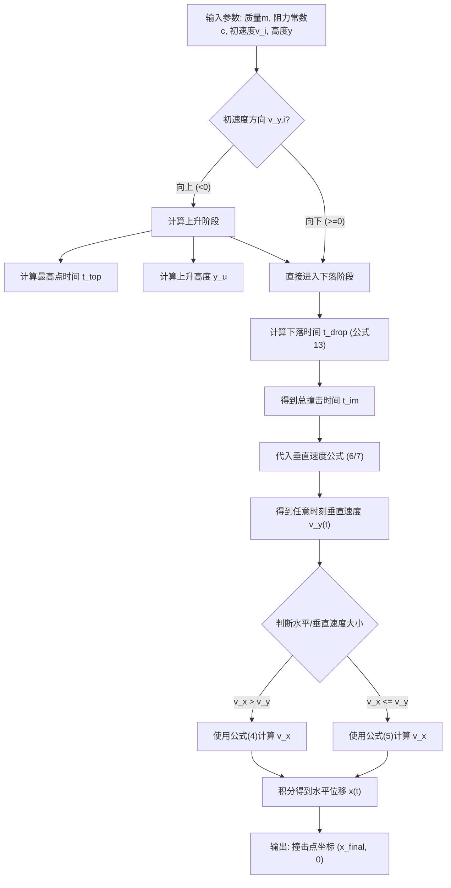
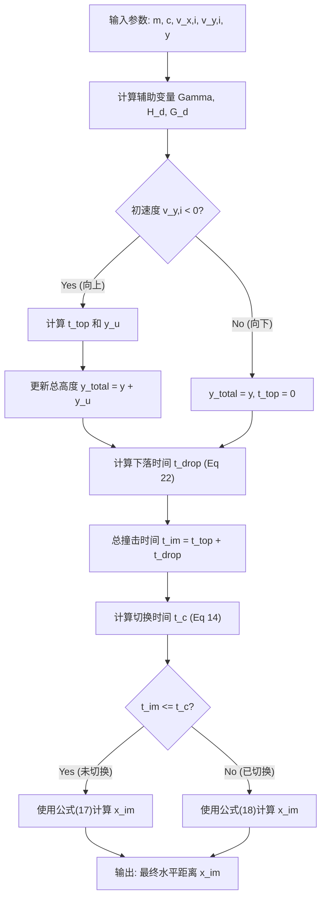

# 论文笔记: Ground impact probability distribution for small unmanned aircraft in ballistic descent

## 1. 论文亮点

这篇论文是无人机安全评估（SORA）领域的重量级文献，核心在于解决“无人机失控坠落会砸到哪”的问题。

### 1.1 核心问题：现有模型太粗糙
*   **物理假设简单**：常假设垂直/水平运动解耦，且阻力线性（一阶）。实际上高速坠落阻力与速度平方成正比（二阶），且运动耦合。
*   **统计假设随意**：常假设落点呈圆形“正态分布”。实际上受风和阻力影响，分布呈拉长的非对称形状。

### 1.2 解决方案：硬核数学推导
*   **物理模型**：采用耦合二阶阻力模型 ($Drag \propto v^2$)，准确描述高速坠落。
*   **数学突破（闭式解）**：推导出了复杂的二阶微分方程组的**闭式解（Closed-form Solution）**，无需数值积分，计算速度提升 **1000倍**。
*   **概率处理**：将输入参数（阻力系数、风速）的不确定性转化为确定的地面撞击概率密度函数（PDF）。

### 1.3 关键结论
*   **分布形状**：真实撞击分布呈水滴形或蛋形，而非圆形。
*   **精度对比**：传统高斯模型会**低估远处风险**，高估中心风险，导致安全评估失真。

### 1.4 实际价值
*   **大规模仿真**：闭式解使得几分钟内完成 **百万次蒙特卡洛模拟** 成为可能。
*   **合规神器**：生成的概率图是申请 **BVLOS（超视距飞行）** 和通过 **SORA 评估** 的关键证据。

---

## 2. 计算难度与突破

### 2.1 什么是“闭式解”？
*   **数值解（笨办法）**：计算机一步步模拟坠落过程（如每0.01秒算一步），计算量巨大。
*   **闭式解（神公式）**：推导出通用公式（如 $H = \frac{1}{2}gt^2$），代入数值直接出结果，无需迭代。

### 2.2 效率对比：蒙特卡洛模拟
模拟 100 万次坠落：
*   **数值解**：需计算 60 亿步（100万次 × 6000步/次），耗时数小时甚至数天。
*   **闭式解**：仅需计算 100 万步（100万次 × 1步/次），耗时仅几秒至几分钟。
*   **结论**：效率提升三个数量级。

### 2.3 数学成就
在考虑二阶阻力、风速影响及运动耦合的情况下，微分方程组极难求解。作者成功推导出闭式解，将复杂的物理问题转化为高效的工程工具，这是本论文最大的技术贡献。

---

## 3. 弹道下坠二阶阻力模型 (Ballistic Drop Quadratic Drag Model)

这一部分是论文的核心物理基础与数学推导。作者通过**“半解耦 (Semi-decoupling)”**假设，将复杂的耦合二阶微分方程转化为可直接计算的**闭式解 (Closed-form Solution)**。

### 3.1 物理假设与基础方程

#### 核心概念
*   **弹道下降 (Ballistic Descent)**：指无人机在失去动力（Crippled）后，仅受重力和空气阻力作用的坠落过程。
*   **二阶阻力模型 (Quadratic Drag)**：阻力与速度的平方成正比 ($Drag \propto v^2$)，这是描述高速坠落最准确的模型。
*   **半解耦假设 (Semi-decoupling)**：为了获得闭式解，作者假设在计算垂直运动时忽略水平速度的影响，但在计算水平运动时考虑垂直速度的阻力贡献。

#### 基础运动方程 (牛顿第二定律)
标准二阶阻力模型方程为：
$$ m\dot{\mathbf{v}} = m\mathbf{g} - c|\mathbf{v}|\mathbf{v} \quad \dots(1) $$

*   $m$: 无人机质量
*   $\mathbf{v}$: 速度向量
*   $\dot{\mathbf{v}}$: 加速度向量
*   $\mathbf{g}$: 重力加速度向量
*   $c$: 阻力常数（包含阻力系数 $C_D$、迎风面积 $A$、空气密度 $\rho$），通常 $c = 0.5 \rho A C_D$

### 3.2 半解耦策略 (Semi-decoupling Strategy)

作者将方程 (1) 拆解为水平 ($x$) 和垂直 ($y$) 两个方向，并引入关键近似：

#### 垂直运动方程 (Vertical Motion)
$$ m\dot{v}_y = mg - c|v_y|v_y \quad \dots(3) $$
*   **近似**：忽略水平速度 $v_x$ 对垂直阻力的贡献。
*   **理由**：水平速度衰减极快，垂直运动主要由重力和垂直阻力主导。
*   **优势**：这是一个标准的一维二阶阻力方程，**存在闭式解**。

#### 水平运动方程 (Horizontal Motion)
$$ m\dot{v}_x = -c \max(v_x, v_y) v_x \quad \dots(2) $$
*   **近似**：阻力系数中的速度项由 $\max(v_x, v_y)$ 决定。
    *   **阶段 1 ($v_x > v_y$)**：水平速度主导阻力。
    *   **阶段 2 ($v_x \le v_y$)**：垂直速度主导阻力（垂直下落拖慢水平前进）。
*   **优势**：通过分段处理，使得水平方程也可积分解出。

---

### 3.3 闭式解公式汇总 (The Closed-form Solutions)

这是实现快速计算的核心公式库。

#### A. 速度公式 (Velocity)

**1. 水平速度 $v_x(t)$**
*   **阶段 1 (水平主导, $v_x > v_y$)**:
    $$ v_x(t) = \frac{mv_{x,i}}{m + v_{x,i}ct} \quad \dots(4) $$
*   **阶段 2 (垂直主导, $v_x \le v_y$)**:
    $$ v_x(t) = v_{x,i} \exp\left(-\frac{c}{m} \int_0^t v_y(\tau) d\tau\right) \quad \dots(5) $$

**2. 垂直速度 $v_y(t)$**
定义终端速度 $\Gamma = \sqrt{mg/c}$ 和参数 $H_u, H_d$。
*   **向上飞 ($v_y < 0$)**:
    $$ v_y(t) = \Gamma \tan(g\gamma t + H_u) \quad \dots(6) $$
*   **向下掉 ($v_y \ge 0$)**:
    $$ v_y(t) = \Gamma \tanh(g\gamma t + H_d) \quad \dots(7) $$

#### B. 位置公式 (Position)

通过对速度积分得到高度 $y(t)$。
*   **向上位移**:
    $$ y_u(t) = -\frac{m}{c} (\ln(\cos(g\gamma t + H_u)) - G_u) \quad \dots(9) $$
*   **向下位移**:
    $$ y_d(t) = \frac{m}{c} (\ln(\cosh(g\gamma t + H_d)) - G_d) \quad \dots(10) $$

#### C. 时间公式 (Time to Impact)

这是风险评估中最关键的公式：给定下落高度 $y$，直接算出所需时间 $t_{drop}$。
$$ t_{drop}(y) = \frac{\Gamma}{g} \left( \text{arccosh}\left( \exp\left(\frac{cy}{m} + G_d\right) \right) - H_d \right) \quad \dots(13) $$

*   **总撞击时间 $t_{im}(y)$**:
    $$ t_{im}(y) = \begin{cases} t_{top} + t_{drop}(y + y_u(t_{top})) & v_{y,i} < 0 \text{ (先上后下)} \\ t_{drop}(y) & v_{y,i} \ge 0 \text{ (直接下落)} \end{cases} $$

---

### 3.4 基础计算流程图 (Basic Calculation Flowchart)

---

### 3.5 距离计算与算法统一 (Distance & Implementation)

这一部分解决了两个工程难题：**确定切换时刻 $t_c$** 和 **计算水平距离**。

#### A. 任务一：寻找神秘的“切换时刻” $t_c$ (The Critical Time)

**问题背景**：
当 $v_x > v_y$ 时，用公式 (4)；当 $v_x \le v_y$ 时，用公式 (5)。
问题是：到底在哪一秒，水平速度 $v_x$ 会等于垂直速度 $v_y$？即 $t_c$ 是多少？

**数学难点**：
联立求解 $v_x(t) = v_y(t)$ 会得到一个超越方程（一边是 $\tanh$，一边是代数分式），通常无解析解。

**作者的“魔法” (Eq 14)**：
作者使用了**连分式截断近似 (Truncation of continued fraction)**，将 $\tanh(x)$ 近似为 $\frac{x}{1+x^2}$ 的形式。这样一替换，方程变成了一个简单的二阶方程。

**近似解公式**：
$$ t_c = \frac{m(gt_{top} - \Gamma H_d + v_{x,i}(1 + (H_d - g\gamma t_{top})^2))}{mg + cv_{x,i}(gt_{top} - \Gamma H_d)} \quad \dots(14) $$

**意义**：
有了这个公式，计算机不用试错，直接代入参数就能算出切换时刻。

#### B. 任务二：计算水平飞了多远 (Traveled Distance)

根据 $t_c$ 将飞行分为两段积分：

**1. 前半段距离 ($t \le t_c$, 水平主导)**
这是一个对数函数，增长较慢但形式简单：
$$ x_{v_x}(t) = \frac{m}{c} \ln(1 + v_{x,i}ct/m) \quad \dots(17) $$

**2. 后半段距离 ($t > t_c$, 垂直主导)**
这里涉及 $\arctan$ 和 $\sinh$，因为此时阻力主要由垂直速度决定，水平速度急剧减小：
$$ x_{v_y}(t) = \frac{v_{x,i}e^{G_d}\Gamma}{g} \left( \arctan(\sinh(g\gamma t + H_d)) - \arcsin(v_{y,i}\gamma) \right) \quad \dots(18) $$

*(注：公式 (18) 中的减项 $\arcsin(v_{y,i}\gamma)$ 是积分常数项，确保位移连续性)*

#### C. 算法统一化 (Actual Calculations)
为了编程方便，作者引入归一化变量（Hat variables），统一处理初速度方向（向上或向下）。

*   **定义变量**:
    $$ \hat{v}_{y,i} = \max(0, v_{y,i}) $$
    $$ \hat{H}_d = \text{arctanh}(\hat{v}_{y,i}/\Gamma) $$
    $$ \hat{G}_d = -\frac{1}{2} \ln(1 - (\hat{v}_{y,i}/\Gamma)^2) $$

*   **统一时间公式**:
    $$ t_{top} = \begin{cases} -\frac{1}{g\gamma} \arctan(v_{y,i}/\Gamma) & v_{y,i} < 0 \\ 0 & v_{y,i} \ge 0 \end{cases} \quad \dots(21) $$
    
    $$ t_{drop}(y) = \frac{1}{g\gamma} \left[ \text{arccosh}\left( \exp\left(\frac{cy}{m} + \hat{G}_d\right) \right) - \hat{H}_d \right] \quad \dots(22) $$

---

### 3.6 修正后的计算流程图 (Revised Flowchart)

