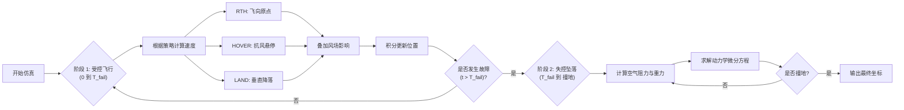
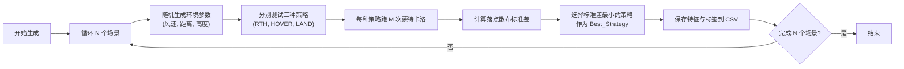

# 无人机搜索策略仿真与数据生成指南

## 1. 模块概述

本模块旨在解决数学建模竞赛中关于无人机失联后的 **定位 (Positioning)** 与 **安全策略制定 (Preparation)** 问题。

我们采用 **“仿真-学习” (Simulation-to-Learning)** 的方法：
1.  **仿真 (Simulation)**：构建基于物理学的无人机飞行与坠落模型，模拟不同安全策略（返航、悬停、降落）在随机环境下的表现。
2.  **数据生成 (Data Generation)**：批量运行仿真，生成包含环境特征与最佳策略标签的合成数据集。
3.  **决策支持 (Decision Support)**：基于数据集训练决策树，为不同场景推荐最优安全程序。

---

## 2. 代码结构与流程

本项目包含两个核心 Python 脚本：

### 2.1 `drone_simulation.py` (核心仿真器)

该脚本定义了 `DroneSimulator` 类，实现了无人机从失联到坠毁的全过程物理模拟。

**核心逻辑流程图：**

### 2.2 `generate_strategy_data.py` (数据生成器)

该脚本调用仿真器，批量生成用于训练决策树的数据。

**数据生成流程图：**

---

## 3. 数学模型详解

### 3.1 阶段 1：受控飞行 (Kinematics)
在此阶段，无人机试图执行指令，但受风影响。模型为运动学模型。

$$ \frac{d\mathbf{r}}{dt} = \mathbf{v}_{cmd} + \mathbf{v}_{wind}(z) $$

其中 $\mathbf{v}_{cmd}$ 取决于策略：
*   **RTH**: $\mathbf{v}_{cmd} = v_{cruise} \cdot \frac{\mathbf{r}_{home} - \mathbf{r}}{\|\mathbf{r}_{home} - \mathbf{r}\|}$
*   **HOVER**: $\mathbf{v}_{cmd} = -\mathbf{v}_{wind}$ (若风速 < 最大空速)，否则 $\mathbf{v}_{cmd} = v_{max} \cdot (-\hat{v}_{wind})$
*   **LAND**: $\mathbf{v}_{cmd} = [0, 0, -v_{descent}]^T$

### 3.2 阶段 2：失控坠落 (Dynamics)
在此阶段，无人机失去动力或控制，遵循牛顿第二定律。

$$ m \frac{d\mathbf{v}}{dt} = \mathbf{G} + \mathbf{D} $$

*   **重力**: $\mathbf{G} = [0, 0, -mg]^T$
*   **阻力**: $\mathbf{D} = -\frac{1}{2} \rho C_d A \|\mathbf{v}_{rel}\| \mathbf{v}_{rel}$
    *   $\mathbf{v}_{rel} = \mathbf{v} - \mathbf{v}_{wind}$

### 3.3 风场模型
采用幂律风切变模型 (Wind Shear Power Law)：
$$ v_{wind}(z) = v_{ref} \cdot \left( \frac{z}{z_{ref}} \right)^\alpha $$
其中 $\alpha \approx 0.15$ 为经验系数。

---

## 4. 问题解答 (Q&A)

### Q1: 与预测相关的不确定性因素是什么？
1.  **故障发生时间 ($T_{fail}$)**：这是最大的随机变量。无人机可能在失联后立即坠落，也可能在返航途中飞行了 5 分钟才坠落。这直接决定了坠落点是在“失联点”附近还是“起飞点”附近。
2.  **风场的不确定性**：山区的阵风和垂直气流会显著改变飞行路径（Phase 1）和坠落轨迹（Phase 2）。
3.  **初始状态误差**：GPS 定位误差和失联瞬间的速度矢量误差。

### Q2: 无人机可以定期发送哪些信息以减少不确定性？
1.  **心跳包 (Heartbeat Signal)**：包含当前执行的策略状态（如 "Executing RTH"）。
2.  **实时风速估算**：利用空速管数据计算出的本机风速向量。
3.  **电池剩余飞行时间**：帮助预测 Phase 1 的最大持续时间。
4.  **IMU 异常震动数据**：若检测到剧烈震动，可能预示即将发生机械故障（预测 $T_{fail}$）。

### Q3: 无人机需要什么样的设备？
1.  **独立通信模块**：自带电池的低功耗信标（如 LoRa/Satellite），确保主电源故障后仍能发送最后的位置。
2.  **空速管 (Pitot Tube)**：用于测量相对空速，从而反推真实风速。
3.  **机载边缘计算单元**：用于在失联状态下自主评估自身健康状况（Health Monitoring），决定是继续返航还是立即迫降。
