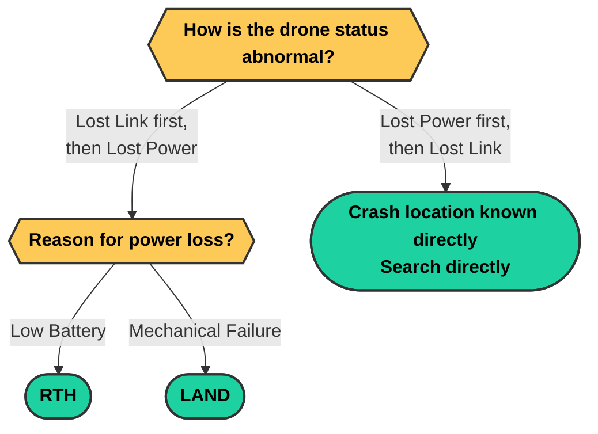

# Simplified Drone Safety Decision Tree

```mermaid
graph TD
    %% --- Node Definitions ---
    %% Root Question
    Root{{"How is the drone status abnormal?"}}
    
    %% Intermediate Question
    Reason{{"Reason for power loss?"}}
    
    %% Leaf Decisions (Actions)
    DirectSearch(["Crash location known directly<br/>Search directly"])
    RTH(["RTH"])
    LAND(["LAND"])

    %% --- Logic Flow ---
    Root -- "Lost Power first,<br/>then Lost Link" --> DirectSearch
    Root -- "Lost Link first,<br/>then Lost Power" --> Reason
    
    Reason -- "Low Battery" --> RTH
    Reason -- "Mechanical Failure" --> LAND

    %% --- Styling ---
    classDef question fill:#feca57,stroke:#333,stroke-width:2px,color:black,font-weight:bold;
    classDef action fill:#1dd1a1,stroke:#333,stroke-width:2px,color:black,font-weight:bold;
    classDef simple fill:#fff,stroke:#333,stroke-width:1px,color:black;

    class Root,Reason question;
    class DirectSearch,RTH,LAND action;
```
