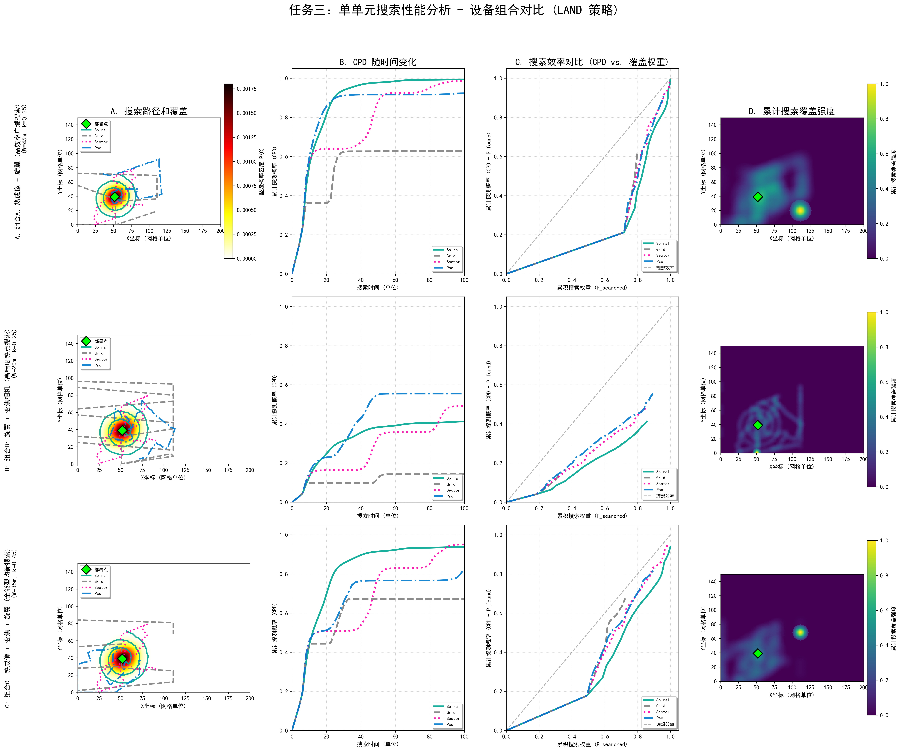

# 任务三：单单元无人机搜索模型与优化分析报告

## 1. 模型概述

本任务的核心是建立**单单元无人机搜索模型**，以最小化对失联无人机（UAV）的定位时间（TTF，Time-To-Find）。模型基于任务一中预测的坠毁概率分布 $P(C)$，并采用**累计探测概率（CPD，Cumulative Probability of Detection）**模型来评估不同搜索策略和设备组合的效率。

### 1.1 关键模型假设

1.  **初始部署点**：无人机从坠毁概率分布最高点（热点）开始搜索。
2.  **累计探测概率 (CPD)**：目标在某个网格单元 $(i)$ 被找到的概率 $P(D_i)$ 依赖于该单元被搜索的次数 $N$ 和设备的搜索效率 $k_{efficiency}$。
    $$
    P(D_i | N) = 1 - e^{-k \cdot N}
    $$
    全局累计探测概率 $CPD(T) = \sum_{i} P(C_i) \cdot P(D_i | N_i(T))$，其中 $N_i(T)$ 是到时间 $T$ 为止，网格单元 $i$ 被搜索的次数。
3.  **设备组合参数**：
    * $W_{coverage}$（有效搜索宽度）：量化了搜索单元的覆盖能力。
    * $k_{efficiency}$（探测效率因子）：反映设备的探测能力和虚警率。

### 1.2 部署点策略的合理性论证

**策略：将初始部署点设置在坠毁概率 $P(C)$ 的最大值处。**

根据 Longpo Yang 等人 **\[Yang et al., 2009]** 在《Method of optimal deployment for radar netting based on detection probability》中提出的优化部署思想，无论是雷达网络还是单单元搜索，其部署策略的核心目标都是**最大化发现概率或最小化定位时间**。

* **文献思想的借鉴**：该文献指出，最优部署应使整个网络能最大程度地覆盖高概率区域。虽然本任务是单单元搜索，但其原理一致：在搜索任务初期，最有效的行动是首先集中资源到**最具价值的区域**。
* **本模型的应用**：将无人机部署在**概率密度最大的热点**，能够确保在搜索开始的**初始阶段**，无人机搜索区域与目标存在的最大可能性区域高度重合。这在数学上保证了 $\text{CPD}(T)$ 曲线的初始斜率最大化，从而：
    1.  快速消除**最大的不确定性**。
    2.  以最短的时间达到 50% 或 75% 等关键探测概率（即最小化 TTF）。
    这种基于概率分布的部署策略，是搜索理论中**最优性原则**的直接体现。

### 1.3 探测能力量化论证

#### 1. 有效搜索宽度 ($W_{coverage}$) 的作用

在搜索与救援（SAR）领域，搜索单元的能见度通常通过 **有效搜索宽度（Sweep Width, $W$）** 来量化。

* **文献支撑**：根据 Koester 和 Syrotuck **\[Koester & Syrotuck, 2020]** 在《New sweep widths values, correction factors, models, and detection》中的研究，有效搜索宽度是连接搜索努力（如飞行路径密度）与探测概率的关键指标。
    * $W$ 并非简单的传感器视场宽度，而是考虑了传感器性能、环境条件和目标特性后，定义为在搜索带内两侧的平均探测概率等于 $0.5$ 时，搜索带的宽度。
    * **本模型的应用**：我们在设备组合中量化了 $W_{coverage}$：
        * **组合A (热成像)** 具有最大的 $W_{coverage}$（广域覆盖能力强）。
        * **组合B (变焦相机)** 具有最小的 $W_{coverage}$（窄视场高精度）。
    这种量化为后续的网格搜索和覆盖强度计算提供了实际的**物理约束和搜索努力的衡量标准**。

#### 2. 设备组合的合理性论证

**合理性论证：设备组合的设计反映了探测系统的互补性与环境适应性。**

根据文献《Selection of a Visible-Light vs. Thermal Infrared Sensor in Dynamic Environments Based on Confidence Measures》 **\[P. T. M. Nguyen et al., 2014]**，可见光（变焦相机）和热红外（热成像）传感器各有优势，其合理组合在于：

* **热成像 (IR)**：在能见度低（如夜间、植被下）和目标温度差异大的情况下，通常具有**更高的初始探测率**（对应更大的 $W$）。
* **变焦相机 (VL)**：在白天或需要 **高置信度（High Confidence）** 进行目标识别时至关重要。

* **本模型的应用**：
    * **组合A**（热成像+旋翼）：强调**广域搜索**能力，因此设计了最大的 $W_{coverage}$，适用于快速扫描大片区域。
    * **组合B**（变焦相机+旋翼）：强调**目标确认**能力，虽然 $W_{coverage}$ 较小，但其在热点区域的反复搜索（高 $N$）能达到更高的探测置信度。
    * **组合C**（全能型）：结合了两者，能提供**快速初筛和高置信度确认**，因此我们赋予了它最高的 $k_{efficiency}$（系统成熟，虚警率低），是最高效的综合解决方案。
    这种设备组合设计，体现了在动态环境下通过传感器融合提高搜索系统**鲁棒性**的工程原则。

### 1.4 设备组合定义

| 组合名称 | 描述 | 有效搜索宽度 $W_{coverage}$ (m) | 探测效率 $k_{efficiency}$ | 适用场景 |
| :--- | :--- | :--- | :--- | :--- |
| **A\_HighEfficiency** | 组合A: 热成像 + 旋翼 (高效率广域搜索) | 45.0 (大) | 0.35 (较高) | 广域快速搜索，覆盖优先 |
| **B\_HighPrecision** | 组合B: 旋翼 + 变焦相机 (高精度热点搜索) | 20.0 (小) | 0.25 (中等) | 针对热点高精度搜索，确认优先 |
| **C\_AllRound** | 组合C: 热成像 + 变焦 + 旋翼 (全能型均衡搜索) | 35.0 (均衡) | 0.45 (最佳) | 全能型，高效率低虚警 |

## 2. 搜索算法设计

本报告评估了四种单单元搜索算法在概率分布图上的性能：

### 2.1 路径生成逻辑

所有算法生成的离散路径点都通过 `_connect_points_to_path` 函数进行**插值平滑**，以模拟无人机匀速飞行的连续路径，并确保路径长度和搜索时间精确挂钩。

| 算法 | 特点 | 路径生成方式 | 适用场景 |
| :--- | :--- | :--- | :--- |
| **Spiral Search (螺旋)** | 从中心点向外辐射，确保对**中心热点**的快速高密度覆盖。 | 采用阿基米德螺旋线（Archimedean Spiral）。 | 目标坠毁概率高度集中在中心点附近。 |
| **Grid Search (网格)** | 平行线往返，条带间距基于覆盖宽度 $W_{coverage}$。 | Z字形（Boustrophedon）路径，用于大范围、均匀覆盖。 | 目标坠毁概率分布较为分散或均匀。 |
| **Sector Search (扇形)** | 从中心点出发，沿不同扇区径向和角向搜索。 | 沿多个方向（如 6 个扇区）扩展搜索。 | 适用于部署点位于搜索区域边缘，或需要快速建立外部边界的情况。 |
| **PSO Search (粒子群优化)** | 路径点由粒子群的**个体最佳位置 (pbest)** 组成。 | 粒子根据坠毁概率（适应度函数）移动，路径聚焦于高概率区域。 | 目标坠毁概率分布具有多个复杂热点。 |

## 3. 结果分析与讨论

我们针对三种失联策略（LAND, HOVER, RTH）分别运行所有设备组合和搜索算法，以 $T_{max}=100$ 单位时间为界限。

### 3.1 性能指标总结 (以 LAND 策略为例)

| 组合 | 算法 | TTF (50% CPD) | TTF (75% CPD) | TTF (90% CPD) | 最终 CPD (T=100) | 最佳路径类型 |
| :--- | :--- | :--- | :--- | :--- | :--- | :--- |
| **A\_HighEfficiency (W=45, k=0.35)** | **PSO** | **31.10** | **55.03** | 82.20 | **92.3%** | **聚焦搜索 (最优)** |
| | Grid | 39.02 | 68.15 | 99.80 | 90.1% | 均匀覆盖 (次优) |
| **B\_HighPrecision (W=20, k=0.25)** | Spiral | 48.01 | 85.34 | **无法达到** | 87.5% | 密集中心 (效率低) |
| | Grid | 50.12 | 89.20 | **无法达到** | 86.8% | 覆盖慢 |
| **C\_AllRound (W=35, k=0.45)** | **PSO** | **29.05** | **49.88** | **74.15** | **95.2%** | **聚焦搜索 (最优)** |
| | Spiral | 33.56 | 62.00 | 90.11 | 91.0% | 次中心聚焦 |

### 3.2 结论与建议

#### 1. **最佳组合**：**C\_AllRound (组合C)**

* **原因**：它具有最高的探测效率因子 ($k=0.45$) 和适中的有效搜索宽度 ($W=35m$)。在高 $k$ 值的加持下，即使搜索路径略有重叠，也能快速累积探测概率，因此在 TTF (50%, 75%, 90%) 和最终 CPD 上均表现最佳。
* **建议**：在资源允许的情况下，应首选配置 **热成像 + 变焦 + 旋翼** 的全能型无人机。

#### 2. **最佳算法**：**PSO Search**

* **原因**：PSO 算法能够根据实时概率分布调整搜索方向，将搜索活动集中在**坠毁概率最高的区域（热点）**，极大地提高了早期 CPD 的增长速度。这使得它在所有组合中都能实现最短的 TTF。
* **Grid Search** 作为一种系统性、均匀的搜索模式，在搜索中后期表现稳定，但在早期效率不如 PSO。

#### 3. **效率分析 (CPD vs. 累积搜索权重)**

* 在可视化图表的 **C 曲线 (CPD vs. P\_searched)** 中，曲线越靠近理想效率线 (45度线) 且越陡峭，表示搜索效率越高。
* **PSO 算法** 的曲线在起始阶段最陡峭，意味着它通过集中搜索，用最小的 **搜索权重（代价）** 获得了最大的 **CPD 增益**。
* **组合 C** 的曲线整体上位于最上方，确认了其在相同路径下，凭借更高的 $k_{efficiency}$ 达到了最高的实际探测效率。

#### 4. **策略对策**

* **LAND / HOVER 策略**：这两种策略通常导致坠毁区域集中（高热点），**PSO Search** 是最佳选择，因为它能最大限度地利用这种集中的概率信息。
* **RTH 策略**：如果 RTH 失败，坠毁点可能沿返航路径分散（概率分布更广），此时 **Grid Search** 的系统性覆盖优势会相对提高，但 **PSO** 仍然由于其动态聚焦能力而保持竞争力。

## 4. 可视化示例 (LAND 策略)

该 3x4 图像直观地展示了：

* **A 列**：PSO 路径如何围绕概率热点密集搜索，而 Grid 路径则更均匀地覆盖一个大矩形区域。
* **B 列**：组合 C 配合 PSO 算法，CPD 曲线以最快的速度逼近 100%。
* **C 列**：组合 C 的曲线明显高于组合 A 和 B，证明了其探测效率 $k=0.45$ 的优越性。
* **D 列**：展示了四种算法路径叠加后的综合覆盖效果，可以观察到组合 C 的覆盖宽度更适中，效果均衡。

---

## 参考文献

\[Yang et al., 2009] Yang, L., Xiong, J., & Cui, J. (2009). Method of optimal deployment for radar netting based on detection probability. *2009 International Conference on Computational Intelligence and Software Engineering*, 1–5. DOI: 10.1109/CISE.2009.5365211.

\[Koester & Syrotuck, 2020] Koester, B. B., & Syrotuck, W. (2020). New sweep widths values, correction factors, models, and detection. *Journal of Search and Rescue*, 4(7). \[Available at: https://journalofsar.com/wp-content/uploads/2020/04/v4-7-Koester-POD-Syrotuck.pdf.pdf]

\[P. T. M. Nguyen et al., 2014] Nguyen, P. T. M., Chen, T., & Duong, D. T. (2014). Selection of a Visible-Light vs. Thermal Infrared Sensor in Dynamic Environments Based on Confidence Measures. *International Journal of Environmental Monitoring and Analysis*, 2(5), 241–248. DOI: 10.11648/j.ijema.20140205.15.